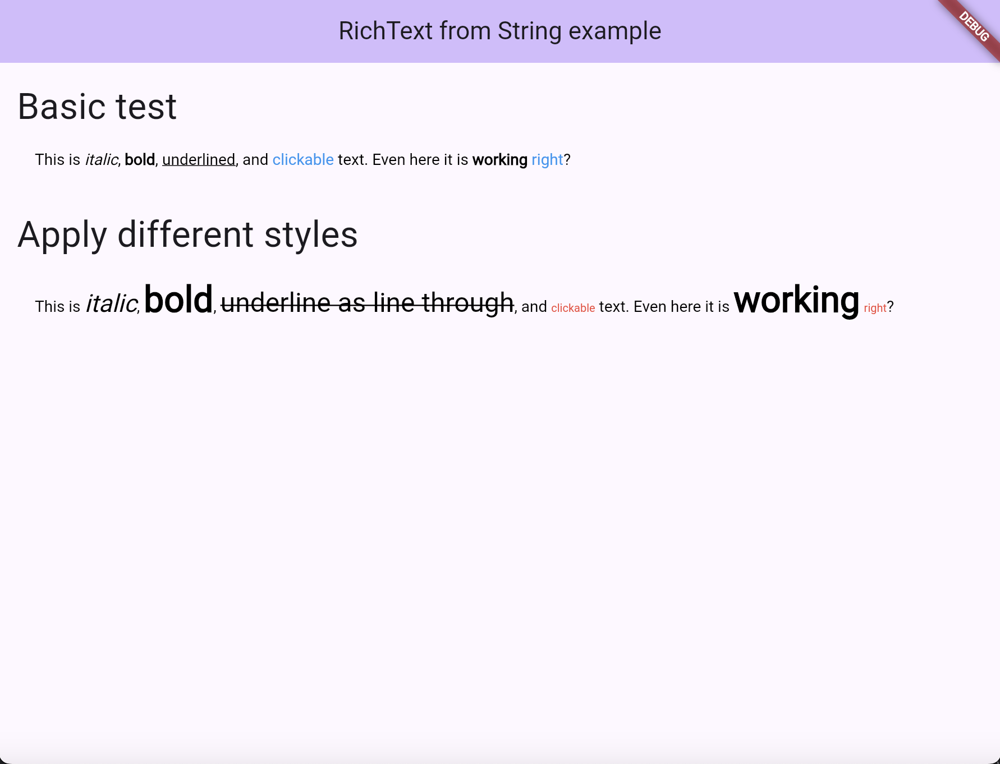

# richtext_from_string
A Flutter package that generates Rich-Text Widgets from Strings

## Features

String to RichText-Widget conversion.

- *italic*
- **bold**
- _underline_
- \[gesture\]\(callbackName\)




## Getting started

It is quite easy to use:

```dart

RichTextConverter converter = RichTextConverter(input);
Widget richText = converter.convert(callbacks: callbacks);
```

If you want to apply your custom styles you can pass an instance of `RichTextOptions`:

```dart
RichTextOptions options = RichTextOptions(
  boldStyle: const TextStyle(
      fontSize: 32, fontWeight: FontWeight.w900),
  italicStyle: const TextStyle(
      fontSize: 22, fontStyle: FontStyle.italic),
  gestureStyle:
  const TextStyle(fontSize: 10, color: Colors.red),
  underlineStyle: const TextStyle(
      fontSize: 24, decoration: TextDecoration.lineThrough),
);
RichTextConverter converter = RichTextConverter(input, options: options);
Widget richText = converter.convert(callbacks: callbacks);
```
That's all to say for now.

## Usage

Head on to [GitHub]() to have a look at the example.

## Additional information

If it appears, that another annotation will be necessary, feel free to contribute and open up
a pull request. But keep in mind to test your changes and write some unit tests.