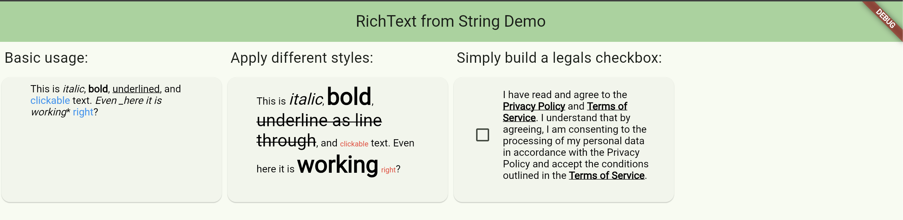

A very simple converter using markdown-like syntax to convert an annotated string into a RichText
widget. The package also provides the ability to change the default styling to suit your own
needs. Since the styling for each annotation is fully customisable, you can also ensure that the
annotations don't prevent you from inserting characters.

One very interesting use case is that you don't need to split your translations anymore. This was
necessary if you wanted to have different click behaviour and different styling for some parts of
the text. Also, languages are very different. And the order of words is different in each language,
which can force you to rearrange your split translations in your multilingual application, which is
quite annoying.

## Features

String to RichText-Widget conversion.

- *italic*
- **bold**
- _underline_
- \[gesture\]\(callbackName\)



## Getting started

It is quite easy to use:

```dart

RichTextFromString converter = RichTextFromString(input);
Widget richText = converter.convert();
```
## Usage

If you want to apply your custom styles you can pass an instance of `RichTextOptions`:

```dart

RichTextOptions options = RichTextOptions(
  basicStyle: const TextStyle(),
  boldStyle: const TextStyle(
      fontSize: 32, fontWeight: FontWeight.w900),
  italicStyle: const TextStyle(
      fontSize: 22, fontStyle: FontStyle.italic),
  gestureStyle:
  const TextStyle(fontSize: 10, color: Colors.red),
  underlineStyle: const TextStyle(
      fontSize: 24, decoration: TextDecoration.lineThrough),
);

RichTextFromString converter = RichTextFromString(input, options: options);
Widget richText = converter.convert();
```

Or if you just want to use custom interactions:

```dart
/// Define callbacks to be invoked when a clickable text is tapped.
/// An example of gesture annotated text might be:
/// "Click [here](actionName) to print!",
/// where [actionName] is the key defined in the callbacks.

Map<String, dynamic> callbacks = {
  "actionName": () => print("Hey, you tapped that text!"),
};

RichTextFromString converter = RichTextFromString(input, callbacks: callbacks);
Widget richText = converter.convert();
```

Head on
to [GitHub](https://github.com/devgpcodelabs/richtext_from_string/blob/main/richtext_from_string/example/richtext_from_string_example/lib/main.dart)
to have a look at the example.

[Pub Dev:](https://pub.dev/packages/richtext_from_string)

## Additional information

If it appears, that another annotation will be necessary, feel free to contribute and open up
a pull request. But keep in mind to test your changes and write some unit tests.